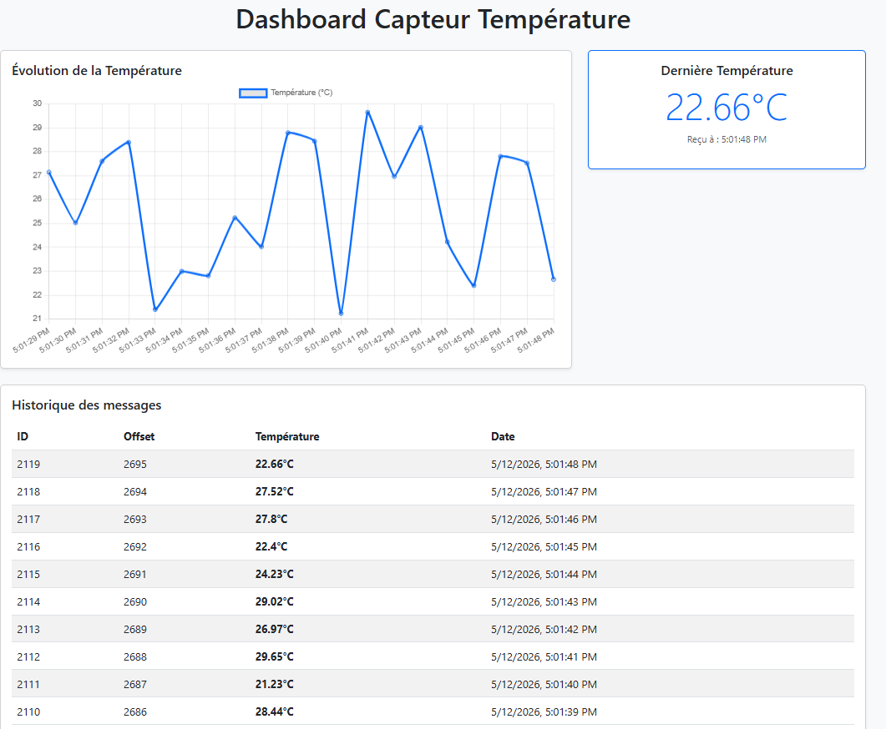

# Real-Time Sensor Monitoring with Apache Kafka, Node.js, and PostgreSQL

A complete end-to-end example of a real-time data streaming and visualization pipeline. This project demonstrates how to produce mock sensor data, stream it through Apache Kafka (using the modern KRaft mode, without ZooKeeper), consume the data, store it in a PostgreSQL database, and visualize it in real-time via a web dashboard.

## 📊 Dashboard Preview

*(Add your actual screenshot image in your repository and update the path below)*

> **Note**: To add your screenshot, take a picture of your dashboard, save it as `screenshot.png` inside the `public` folder, and it will appear here.

---

## 🏗️ Architecture

1. **Producer (`producer.js`)**: Generates random temperature data every second and publishes it to a Kafka topic.
2. **Kafka Broker (KRaft Mode)**: Acts as the central event streaming platform handling the message queue.
3. **Consumer (`consumer.js`)**: Subscribes to the Kafka topic, reads the incoming streams in real-time, parses the JSON payload, and inserts the records into a database.
4. **Database (PostgreSQL)**: Persistently stores the historical sensor data.
5. **REST API & Server (`server.js`)**: An Express application that serves the frontend dashboard and exposes endpoints (`/messages`) to fetch historical data.
6. **Frontend Dashboard (`public/index.html`)**: A responsive UI built with Bootstrap and Chart.js that polls the API to display real-time line charts and data tables.

---

## 🚀 Prerequisites

To run this project, you will need:
- **Java 17+** (Required for Kafka)
- **Node.js** (v14 or higher)
- **Docker** (For easily running PostgreSQL)
- **Apache Kafka 4.2+** binaries

---

## 🛠️ Step-by-Step Setup Guide

### 1. Start PostgreSQL (via Docker)
Run the following command to start a PostgreSQL database in the background:
docker run --name pg-kafka -e POSTGRES_PASSWORD=root -e POSTGRES_USER=postgres -e POSTGRES_DB=tp_kafka -p 5432:5432 -d postgres

### 2. Setup and Start Apache Kafka (KRaft Mode)
Download Kafka and extract it:
wget https://archive.apache.org/dist/kafka/4.2.0/kafka_2.13-4.2.0.tgz
tar -xzf kafka_2.13-4.2.0.tgz
cd kafka_2.13-4.2.0

Format the KRaft storage and start the server:
# Generate Cluster ID and format storage
KAFKA_CLUSTER_ID="$(bin/kafka-storage.sh random-uuid)"
bin/kafka-storage.sh format --standalone -t "$KAFKA_CLUSTER_ID" -c config/server.properties

# Start the Kafka Broker (Leave this terminal running)
bin/kafka-server-start.sh config/server.properties

Create the topic:
*Open a new terminal in the Kafka directory:*
bin/kafka-topics.sh --create --partitions 3 --replication-factor 1 --topic test-topic --bootstrap-server localhost:9092

### 3. Setup the Node.js Application
Navigate to the Node.js project directory (or create it), initialize the project, and install dependencies:
npm install kafkajs express pg dotenv

---

## 🏃‍♂️ Running the Application

You will need **three separate terminal windows** to run the components concurrently. Make sure you are in the project root directory for all of them.

### Terminal 1: Start the Producer
The producer will start generating temperature data every second.
node producer.js

### Terminal 2: Start the Consumer
The consumer will read the data from Kafka and insert it into the PostgreSQL database. (The table `kafka_messages` is created automatically on the first run).
node consumer.js

### Terminal 3: Start the Web Server & API
Start the Express server to expose the REST API and serve the dashboard.
node server.js

---

## 🌐 Visualization

Once all services are running, open your web browser and navigate to:

👉 **`http://localhost:3000`**

You will see the real-time monitoring dashboard with the live temperature chart and a tabular history of the incoming messages.

## 📂 Project Structure

.
├── db.js                # PostgreSQL connection pool and table initialization
├── producer.js          # Kafka Producer (generates mock sensor data)
├── consumer.js          # Kafka Consumer (reads from Kafka, writes to DB)
├── server.js            # Express REST API and static file server
├── package.json         # Node.js dependencies
└── public/
    └── index.html       # Real-time Dashboard UI (Chart.js & Bootstrap)

## 📝 License
This project is open-source and available under the [MIT License](LICENSE). Feel free to use it as a boilerplate for your own Kafka streaming applications!